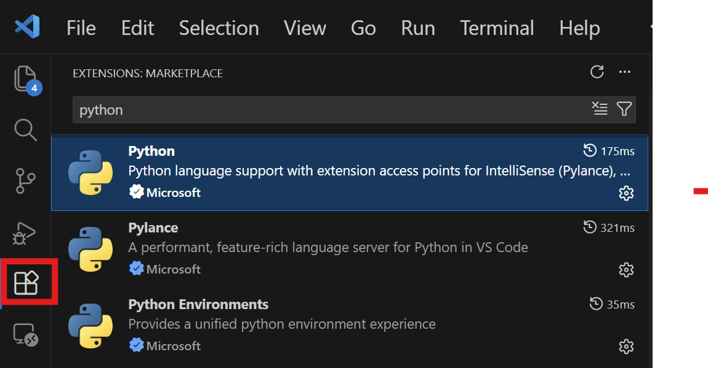
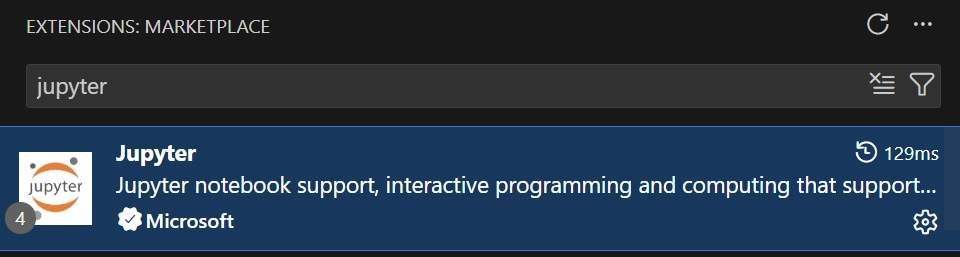

## Python 설치

### pyenv

- pyenv는 한 대의 컴퓨터에서 여러 버전의 파이썬을 자유롭게 설치하고 전환할 수 있게 해주는 파이썬 버전 관리 도구이다.

<br>

<details> 

<summary>
Window
</summary>

### pyenv 설치

pyenv-win/docs/installation.md at master · pyenv-win/pyenv-win

1. window키 → PowerShell 검색 → 관리자 권한으로 실행
2. 아래 명령어 입력 후 PowerShell 종료
    
    ```bash
    git clone https://github.com/pyenv-win/pyenv-win.git "$env:USERPROFILE\.pyenv"
    ```
    
    ```bash
    [System.Environment]::SetEnvironmentVariable('PYENV', $env:USERPROFILE + "\.pyenv\pyenv-win\", "User")
    [System.Environment]::SetEnvironmentVariable('PYENV_ROOT', $env:USERPROFILE + "\.pyenv\pyenv-win\", "User")
    [System.Environment]::SetEnvironmentVariable('PYENV_HOME', $env:USERPROFILE + "\.pyenv\pyenv-win\", "User")
    ```
    
    ```bash
    [System.Environment]::SetEnvironmentVariable('PATH', $env:USERPROFILE + "\.pyenv\pyenv-win\bin;" + $env:USERPROFILE + "\.pyenv\pyenv-win\shims;" + [System.Environment]::GetEnvironmentVariable('PATH', "User"), "User")
    ```
    
3. 권한 문제가 발생한다면 아래 명령어 입력 후 PowerShell 종료. 이후 2번 명령어 입력
    
    ```jsx
    Set-ExecutionPolicy RemoteSigned -Scope CurrentUser -Force
    ```
    
- bash에서 인식이 안된다면
    
    ```bash
    cat >> ~/.bashrc << 'EOF'
    # pyenv-win
    export PYENV_ROOT="$HOME/.pyenv/pyenv-win"
    export PATH="$PYENV_ROOT/bin:$PYENV_ROOT/shims:$PATH"
    EOF
    ```
    
### python 설치

1. 파이썬 3.13 버전 설치
PowerShell 에 아래 명령어 입력
    
    ```bash
    pyenv install 3.13
    ```
    
2. 3.13 버전의 python 설정
PowerShell 에 아래 명령어 입력
    
    ```bash
    pyenv global 3.13
    ```
    
3. 파이썬 버전 확인
    
    ```bash
    python --version
    ```
    
</details> 

<br>

<details> 

<summary>
Mac
</summary>

### Homebrew 설치

homebrew는 macOS 운영 체제의 소프트웨어 패키지 관리 시스템이다.

1. terminal 열기
    -  spotlight에서 terminal 검색
2. 아래 명령어 실행
    
    ```jsx
    /bin/bash -c "$(curl -fsSL https://raw.githubusercontent.com/Homebrew/install/HEAD/install.sh)"
    ```
    

### pyenv 설치

1. terminal 열기
    -  spotlight에서 terminal 검색

1. 아래 명령어 실행
    
    ```jsx
    brew install pyenv
    ```
    
    ```jsx
    pyenv init --install
    ```
    

### python 설치

1. 파이썬 3.13 버전 설치
terminal에 아래 명령어 입력
    
    ```bash
    pyenv install 3.13
    ```
    
2. 3.13 버전의 python 설정
terminal 에 아래 명령어 입력
    
    ```bash
    pyenv global 3.13
    ```
    
3. 파이썬 버전 확인
    
    ```bash
    python --version
    ```
    
</details> 

<br>

## VScode 설정

좌측의 `Extensions`에서 

- python 검색 후 설치
    
    
    

- jupyter 검색 후 설치
    
    
